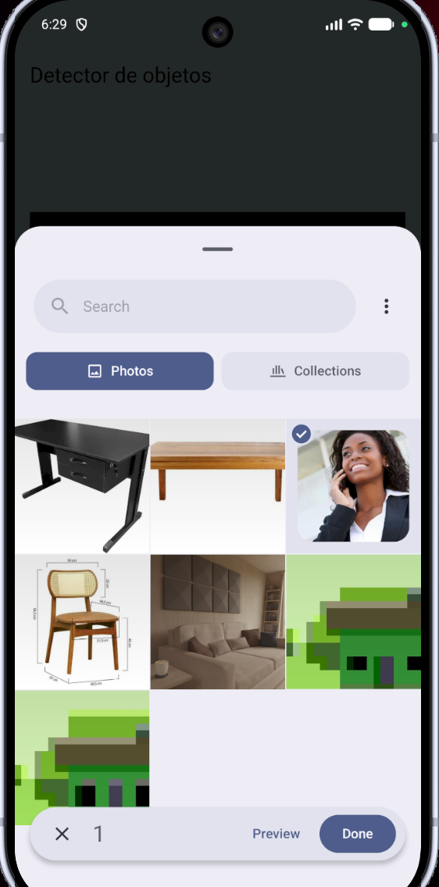
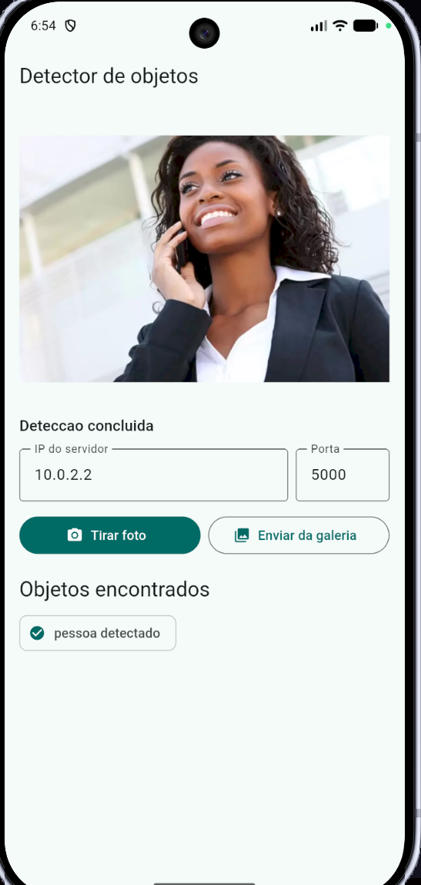
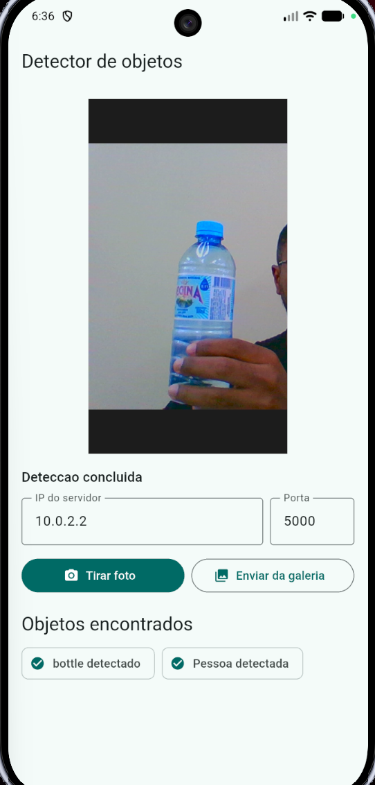
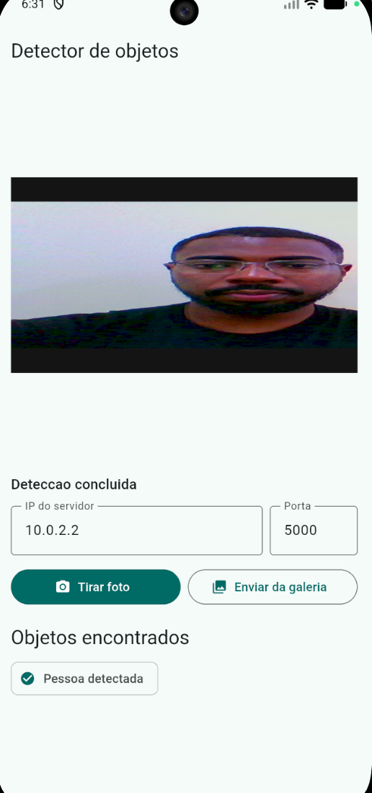

 # Detector de objetos

Aplicação de detecção de objetos composta por um servidor Python e um cliente Flutter. O cliente captura uma foto pela câmera ou seleciona uma imagem da galeria, envia o JPEG ao servidor por TCP e exibe a imagem e os objetos detectados.

## Funcionalidades

- Captura de imagens pela câmera do dispositivo.
- Seleção de imagens da galeria.
- Redimensionamento e compressão da imagem antes do envio.
- Comunicação TCP entre o aplicativo e o servidor.
- Detecção de objetos com YOLO11n.
- Exibição dos objetos detectados em português.

## Estrutura do projeto

```text
flutter_application_1/
├── client/
│   ├── lib/
│   │   └── main.dart              # Aplicativo Flutter e cliente TCP
│   ├── pubspec.yaml               # Dependências do app
│   └── android/                   # Configuração Android
├── server/
│   ├── server.py                  # Servidor TCP e inferência YOLO
│   ├── requirements.txt           # Dependências Python
│   └── yolo11n.pt                 # Pesos do modelo YOLO
└── README.md
```

## Pré-requisitos

- Python 3.10 ou superior.
- Flutter SDK instalado e configurado no `PATH`.
- Android Studio, SDK Android e um dispositivo Android ou emulador para executar o app.
- O arquivo `server/yolo11n.pt` presente no projeto.

## Como executar no Linux

Abra um terminal na raiz do projeto.

### 1. Preparar e iniciar o servidor

```bash
cd server
python3 -m venv .venv
source .venv/bin/activate
python -m pip install -r requirements.txt
python server.py --host 0.0.0.0 --port 5000
```

O servidor ficará aguardando conexões na porta `5000`.

### 2. Executar o aplicativo Flutter

Em outro terminal:

```bash
cd client
flutter pub get
flutter devices
flutter run
```

Para executar diretamente em um dispositivo específico:

```bash
flutter run -d <id-do-dispositivo>
```

## Como executar no Windows

Abra o PowerShell na raiz do projeto.

### 1. Preparar e iniciar o servidor

```powershell
cd server
py -m venv .venv
.\.venv\Scripts\Activate.ps1
python -m pip install -r requirements.txt
python server.py --host 0.0.0.0 --port 5000
```

Se a política do PowerShell impedir a ativação do ambiente virtual, execute o servidor diretamente pelo Python do ambiente:

```powershell
.\.venv\Scripts\python.exe server.py --host 0.0.0.0 --port 5000
```

### 2. Executar o aplicativo Flutter

Em outro PowerShell:

```powershell
cd client
flutter pub get
flutter devices
flutter run
```

Também é possível gerar o APK de debug:

```powershell
flutter build apk --debug
```

O APK será gerado em `client/build/app/outputs/flutter-apk/app-debug.apk`.

## Configuração de IP e porta

O cliente possui os campos **IP do servidor** e **Porta** na tela. Os valores iniciais são:

```text
IP:   10.0.2.2
Porta: 5000
```

O endereço `10.0.2.2` é um alias especial do emulador Android que aponta para o computador hospedeiro. Ele deve ser usado quando o servidor estiver rodando no mesmo computador do emulador.

Para um celular físico, o computador e o celular precisam estar na mesma rede. Nesse caso:

1. Descubra o IPv4 do computador.
	 - Linux: `ip addr` ou `hostname -I`.
	 - Windows: `ipconfig`.
2. Informe esse IPv4 no campo **IP do servidor** do app.
3. Mantenha a porta igual nos dois lados, por exemplo `5000`.
4. Libere a porta no firewall do sistema, caso necessário.

O servidor aceita os parâmetros pela linha de comando:

```bash
python server.py --host 0.0.0.0 --port 5000
```

O cliente abre uma conexão TCP com o IP e a porta informados. A imagem é enviada precedida por um cabeçalho de 4 bytes contendo o tamanho do JPEG, e o servidor responde com um JSON terminado por quebra de linha.

## Modelo e biblioteca de detecção

O projeto utiliza o modelo **YOLO11n** (`server/yolo11n.pt`) por meio da biblioteca **Ultralytics**. A versão `n` significa *nano*: é uma variante menor e mais rápida, adequada para uma aplicação que precisa responder com baixa latência, embora tenha menos capacidade que variantes maiores.

O fluxo de detecção no servidor é:

1. O servidor recebe os bytes do JPEG pela conexão TCP.
2. O OpenCV decodifica os bytes em uma imagem (`cv2.imdecode`).
3. A biblioteca Ultralytics executa o modelo YOLO sobre a imagem.
4. O modelo localiza objetos usando caixas delimitadoras e classifica cada caixa.
5. O servidor envia o nome da classe e a confiança de cada detecção em JSON.

Trecho essencial do servidor:

```python
from ultralytics import YOLO

model = YOLO("yolo11n.pt")
result = model(image, verbose=False)[0]

objects = [
		{
				"label": result.names[int(class_id)],
				"confidence": round(float(confidence), 3),
		}
		for class_id, confidence in zip(result.boxes.cls, result.boxes.conf)
]
```

O modelo treinado com as classes COCO pode reconhecer objetos como pessoas, garrafas, cadeiras, carros, animais, alimentos e outros itens. A tradução dos nomes para português é feita no cliente Flutter antes da apresentação na tela.

## Código mínimo do servidor

O servidor usa TCP para receber uma imagem por conexão:

```python
image_size = struct.unpack("!I", receive_exact(connection, 4))[0]
jpeg = receive_exact(connection, image_size)
objects = detect_objects(model, jpeg)
response = {"objects": objects}
connection.sendall((json.dumps(response) + "\n").encode("utf-8"))
```

O código completo está em [server/server.py](server/server.py).

## Código mínimo do aplicativo

O app seleciona ou captura a imagem e envia os bytes preparados ao cliente TCP:

```dart
final photo = await _imagePicker.pickImage(source: ImageSource.gallery);
if (photo == null) return;

final photoBytes = await photo.readAsBytes();
final jpeg = _prepareJpeg(photoBytes);
final objects = await TcpDetectorClient(
	host: _hostController.text.trim(),
	port: int.parse(_portController.text.trim()),
).detect(jpeg);
```

O código completo do app está em [client/lib/main.dart](client/lib/main.dart).

## Capturas de tela

As capturas abaixo representam o fluxo principal do aplicativo: seleção da imagem, imagem carregada na tela e resultado da detecção.

> As imagens anexadas ao trabalho devem ser salvas no diretório `docs/screenshots/` com os nomes abaixo para que sejam exibidas no GitHub.

### Seleção da imagem na galeria




### Imagem capturada ou carregada



### Resultado da detecção



### Resultado



## Observações

- O servidor precisa estar em execução antes de pressionar **Tirar foto** ou **Enviar da galeria**.
- A imagem é reduzida para no máximo 1280 pixels de largura e codificada em JPEG antes do envio.
- O limite máximo aceito pelo servidor é de 20 MB por imagem.
- Em caso de erro de conexão, confira o IP, a porta, a rede local e as regras do firewall.
